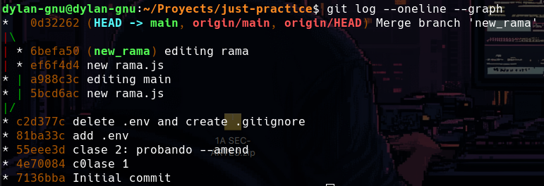

# just-practice

# Clase 1

Aprendí cómo poner el email global
Aprendí cómo poner un entorno de desarrollo por default
ya que puedo utilizar diferentes IDEs para diferentes proyectos.

# Clase 2

Aprendí los siguiente comandos:
git commit --amend -m "nuevo mensaje": Sirve para cambiar el mensaje del último commit, así ya nos evitamos hacer un nuevo commit para solo cambiar el mensaje.
git switch: Cambia la rama, git branch ya es antiguo y tiene otra función.
Aprendí cómo hacer que mi archivo commiteado deje de estar trackeado y también deje de estar en el repositorio, solo en mi área de trabajo.

1. borrar el archivo
2. crear .gitignore
3. commit
4. git push
5. crear .env
   Aprendí que HEAD es dónde está el repositorio actualmente

# Clase 3

Clase de Ramas, Merge y Conflictos

## Merging

En el desarrollo de software hay muchas ramas para trabajar, entre ellos están main, develop, test depende mucho del gitflow. Al hacer merge git crea un nuevo commit llamado fast-forwarding pero este solo es cuando el main no cambia, entonces el puntero solo va al main y ya. La cosa cambia cuando tanto el main como la nueva rama han cambiado ahí se hace un commit de merge donde pueden haber conflictos.

Comandos que aprendí:
git merge <new_rama>: Tengo que estar en la rama que quiero unificar, en este caso main o si existiera develop
git branch -d <rama_name>: Para borrar la rama en caso de que esté merged, hacer como un --force sería git branch -D <rama_name>

git log --one-line --graph

# Clase 4

git push -f o git push --force: Hace que el push al repositorio remoto sobreescriba el historial de push, muy peligroso y no recomendable.
git push -u o git push --set-upstream: Hace que el repositorio local trackee la rama y lo suba a la rama y no al main directamente.

Se puede hacer push al main desde otra rama pero esto sobreescribirá el main también, no es lo mejor trabajando en equipo

Aprendi que en los pull request son importantes los cambios especificos y no así varios cambios en uno, un gif o una imagen podrían explicar bien el cambio.

Al revisar un pull request también es bueno dar feedback o incluso corregir el código.

# Clase 5

Aprendí los flujos de Git Flow, GitHub Flow y la Ship, Show, Ask.

## Git Flow

Git Flow es el más clásico tiene ramas para la mayoría de funciones, estás son las principales

1. main: Es la rama de producción, aquí es el código que se ve en el despliegue
2. develop: Esta es la segunda más importante porque todo se mergea aquí antes del main, y de está parten las demás ramas
3. feature: Ramas para nuevas funcionalidades
4. hot-fix: Arreglar bugs de producción, directamente merge a main
5. realease: Ya apunto de mergearlo al main como cambios de último momento

## GitHub Flow

Es un flujo más rápido que despliega seguido, es ideal para páginas web, es necesario un buen CD/CI para ponerlo en práctica, es para usuarios más avanzados

## Ship, Show, Ask

Es muy bueno pero se necesita de un equipo responsable y un buen sistema de CI/CD ya que los cambios se fusionan directo al main, sin preguntar. Es bueno cuando hay mucha confianza y agilidad
